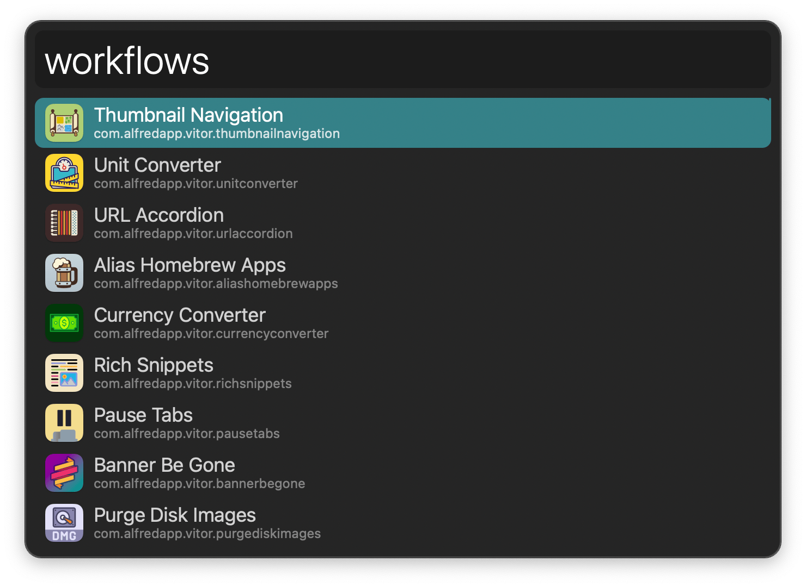

#  Workflow Actions Alfred Workflow

Fast workflow interactions for creators

[⤓ Install on the Alfred Gallery](https://alfred.app/workflows/alfredapp/workflow-actions)

## Usage

Search installed workflows, ordered by recently edited, via the `workflows` keyword.

* <kbd>↩</kbd> Open in Alfred Preferences.
* <kbd>⌘</kbd><kbd>↩</kbd> Open in Terminal.
* <kbd>⌥</kbd><kbd>↩</kbd> Open in Finder.
* <kbd>⌃</kbd><kbd>↩</kbd> Open Data Folders.
* <kbd>⇧</kbd><kbd>↩</kbd> Export.
* <kbd>⌘</kbd><kbd>⌥</kbd><kbd>⌃</kbd><kbd>↩</kbd> View all actions.

Change default modifiers for actions in the [Workflow’s Configuration](https://www.alfredapp.com/help/workflows/user-configuration/).
